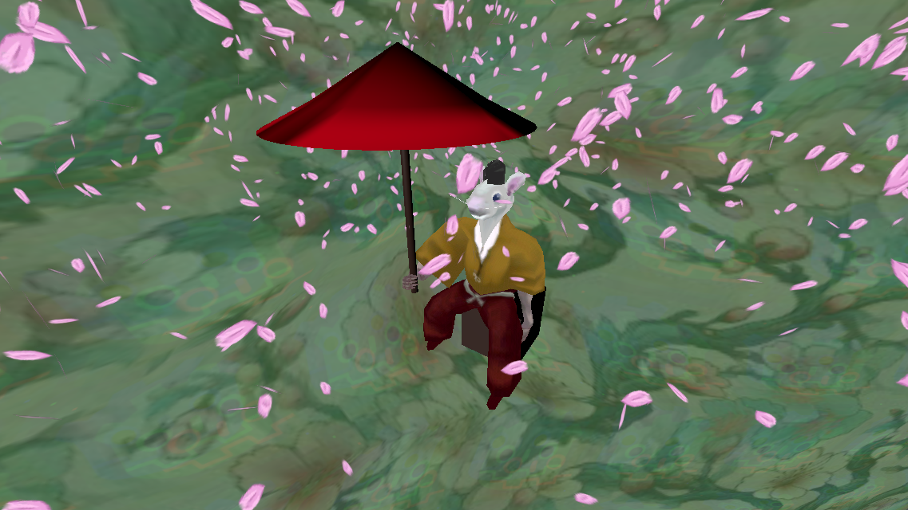

# Ohanami 

Godotはゲームだけじゃなくてアート表現もできるのが楽しいですね。コードの整理をせずにつくったのでわかりにくいと思いますが、今後時間を作って整理いくつもりです。

# License

コードのlicenseはMITとします(See LICENSE.md)

一応3Dモデルの著作権は0から作ったので主張したいと思います。ただ、コミュニティー内の方々に自由に使ってもらいたいとも考えています。今後どうするかは考えさせてください。このレポジトリには生のblenderファイルはおいていません。